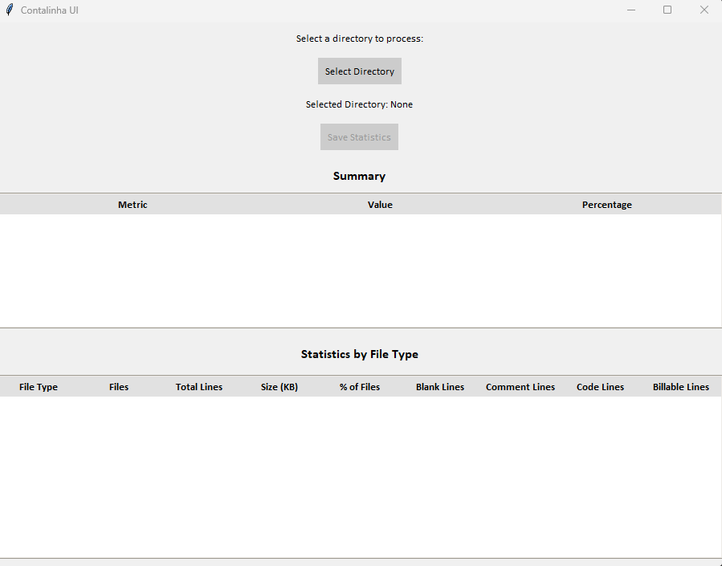

# Conta Linha Script

 <!-- Assuming screenshot.png might need an update later for the UI -->

[English](#english) | [Português](#português-do-brasil)

<a name="english"></a>
## English

### **IMPORTANT UPDATE: UI Version Now Available!**
A new graphical user interface (GUI) version of this script, `contalinha-ui.py`, is now the primary version and will receive all future updates and new features. The original command-line script, `contalinha.py`, will no longer be updated with new functionalities but will remain available for use.

### Description
This Python script analyzes a specified directory, counts the total number of files, lines of code, blank lines, comment lines, and the total size of the files. 
The **UI version (`contalinha-ui.py`)** provides a graphical interface for directory selection and displays results in interactive tables.
The **command-line version (`contalinha.py`)** provides console output.
Both versions save a detailed report in CSV format.

### Requirements
*   Python 3.x
*   For `contalinha-ui.py` (GUI version):
    *   Python's built-in Tkinter module (usually included with Python installations).
*   For `contalinha.py` (Command-line version):
    *   `rich` library (see `requirements.txt`)

### Installation
1.  Make sure you have Python 3 installed on your system.
2.  Clone or download this repository.
3.  Navigate to the directory where the files are located using the terminal.
4.  For the command-line version (`contalinha.py`), install its dependency:
    ```bash
    pip install -r requirements.txt
    ```
    (The UI version `contalinha-ui.py` does not require this step as Tkinter is standard.)

### Usage

#### **`contalinha-ui.py` (Graphical User Interface - Recommended)**
1.  Navigate to the script's directory in your terminal.
2.  Run the script:
    ```bash
    python contalinha-ui.py
    ```
3.  Use the "Select Directory" button to choose the directory you want to analyze.
4.  Results will be displayed in the UI.
5.  Use the "Save Statistics" button to save the results to a CSV file.

#### **`contalinha.py` (Command-Line Interface - Legacy)**
You can run the script in two ways:

1.  **With directory as argument:**
    ```bash
    python contalinha.py /path/to/your/directory
    ```
    Replace `/path/to/your/directory` with the full path. Requires `rich` library.

2.  **Interactive:**
    ```bash
    python contalinha.py
    ```
    If run without a directory path, it will prompt for the path. Requires `rich` library.

#### **`contalinha.exe` (Windows Executable for CLI - Legacy)**
The `contalinha.exe` file (if previously packaged) is for the command-line version.
*   Open Command Prompt (cmd) or PowerShell.
*   Navigate to its directory.
*   Run with argument: `.\contalinha.exe /path/to/your/directory`
*   Or run interactively: `.\contalinha.exe`

### Output

#### **UI Version (`contalinha-ui.py`)**
*   Displays the selected directory.
*   A "Summary" table with: Total Files, Total Lines, Total Size, Blank Lines, Comment Lines, Code Lines, and Billable Lines (each with values and percentages where applicable).
*   A "Statistics by File Type" table showing: File Type, Files, Total Lines, Size (KB), % of Files, Blank Lines, Comment Lines, Code Lines, and Billable Lines for each extension.
    *   This table is **scrollable** for directories with many file types.
    *   Columns in this table are **sortable** by clicking their headers (click again to toggle order).
*   A "Save Statistics" button to save a detailed CSV report.

#### **Command-Line Version (`contalinha.py`)**
*   A summary panel with total files, total lines, blank lines, comment lines, code lines, and total size.
*   A statistics panel by file type.

#### **CSV Report (Generated by both versions)**
A CSV file named `result_YYYY-MM-DD-HH-MM.csv` containing:
1.  Statistics by extension.
2.  A detailed list of each file (relative path, type, size, line counts, etc.).

### Updates

#### **May 9, 2025 - UI Version Introduced & Enhanced!**
*   **New GUI version `contalinha-ui.py` created using Tkinter.**
    *   Features directory selection via dialog.
    *   Displays results in two clear tables (Summary and Per Extension).
    *   Includes a "Save Statistics" button.
    *   The "Statistics by File Type" table is **scrollable**.
    *   Columns in the "Statistics by File Type" table are **sortable**.
*   **The command-line script `contalinha.py` is now considered legacy and will not receive new features. Future development will focus on `contalinha-ui.py`.**

#### May 7, 2025 (CLI Version)
*   Added "Billable Lines" column to both console and CSV outputs.
*   "Billable Lines" are calculated as Total Lines - Blank Lines.

#### April 9, 2025 (CLI Version)
*   Added warning system for unrecognized file extensions.

#### April 7, 2025 (CLI Version)
*   Added detection of blank/comment lines, code line calculation, percentages, and enhanced language support.

---

<a name="português-do-brasil"></a>
## Português do Brasil

### **ATUALIZAÇÃO IMPORTANTE: Versão com Interface Gráfica Disponível!**
Uma nova versão com interface gráfica (GUI), `contalinha-ui.py`, é agora a versão principal e receberá todas as futuras atualizações e novas funcionalidades. O script original de linha de comando, `contalinha.py`, não será mais atualizado com novas funcionalidades, mas permanecerá disponível para uso.

### Descrição
Este script Python analisa um diretório especificado, conta o número total de arquivos, linhas de código, linhas em branco, linhas de comentários e o tamanho total dos arquivos.
A **versão com UI (`contalinha-ui.py`)** fornece uma interface gráfica para seleção de diretório e exibe os resultados em tabelas interativas.
A **versão de linha de comando (`contalinha.py`)** fornece saída no console.
Ambas as versões salvam um relatório detalhado em formato CSV.

### Requisitos
*   Python 3.x
*   Para `contalinha-ui.py` (versão GUI):
    *   Módulo Tkinter embutido do Python (geralmente incluído nas instalações Python).
*   Para `contalinha.py` (versão de Linha de Comando):
    *   Biblioteca `rich` (veja `requirements.txt`)

### Instalação
1.  Certifique-se de ter o Python 3 instalado em seu sistema.
2.  Clone ou baixe este repositório.
3.  Navegue até o diretório onde os arquivos estão localizados usando o terminal.
4.  Para a versão de linha de comando (`contalinha.py`), instale sua dependência:
    ```bash
    pip install -r requirements.txt
    ```
    (A versão UI `contalinha-ui.py` não requer este passo, pois o Tkinter é padrão.)

### Uso

#### **`contalinha-ui.py` (Interface Gráfica do Usuário - Recomendado)**
1.  Navegue até o diretório do script no seu terminal.
2.  Execute o script:
    ```bash
    python contalinha-ui.py
    ```
3.  Use o botão "Select Directory" para escolher o diretório que deseja analisar.
4.  Os resultados serão exibidos na interface.
5.  Use o botão "Save Statistics" para salvar os resultados em um arquivo CSV.

#### **`contalinha.py` (Interface de Linha de Comando - Legado)**
Você pode executar o script de duas maneiras:

1.  **Com diretório como argumento:**
    ```bash
    python contalinha.py /caminho/para/seu/diretorio
    ```
    Substitua `/caminho/para/seu/diretorio` pelo caminho completo. Requer a biblioteca `rich`.

2.  **Interativo:**
    ```bash
    python contalinha.py
    ```
    Se executado sem um caminho de diretório, solicitará o caminho. Requer a biblioteca `rich`.

#### **`contalinha.exe` (Executável Windows para CLI - Legado)**
O arquivo `contalinha.exe` (se empacotado anteriormente) é para a versão de linha de comando.
*   Abra o Prompt de Comando (cmd) ou PowerShell.
*   Navegue até o seu diretório.
*   Execute com argumento: `.\contalinha.exe /caminho/para/seu/diretorio`
*   Ou execute interativamente: `.\contalinha.exe`

### Saída

#### **Versão UI (`contalinha-ui.py`)**
*   Exibe o diretório selecionado.
*   Uma tabela "Resumo" com: Total de Arquivos, Total de Linhas, Tamanho Total, Linhas em Branco, Linhas de Comentário, Linhas de Código e Linhas Faturáveis (cada um com valores e porcentagens, quando aplicável).
*   Uma tabela "Estatísticas por Tipo de Arquivo" mostrando: Tipo de Arquivo, Arquivos, Linhas Totais, Tamanho (KB), % de Arquivos, Linhas em Branco, Linhas de Comentário, Linhas de Código e Linhas Faturáveis para cada extensão.
    *   Esta tabela possui **barra de rolagem** para diretórios com muitos tipos de arquivo.
    *   As colunas nesta tabela são **ordenáveis** clicando em seus cabeçalhos (clique novamente para inverter a ordem).
*   Um botão "Salvar Estatísticas" para salvar um relatório CSV detalhado.

#### **Versão de Linha de Comando (`contalinha.py`)**
*   Um painel de resumo com total de arquivos, linhas totais, linhas em branco, linhas de comentário, linhas de código e tamanho total.
*   Um painel de estatísticas por tipo de arquivo.

#### **Relatório CSV (Gerado por ambas as versões)**
Um arquivo CSV chamado `result_AAAA-MM-DD-HH-MM.csv` contendo:
1.  Estatísticas por extensão.
2.  Uma lista detalhada de cada arquivo (caminho relativo, tipo, tamanho, contagens de linha, etc.).

### Atualizações

#### **9 de Maio de 2025 - Versão UI Introduzida e Aprimorada!**
*   **Nova versão GUI `contalinha-ui.py` criada usando Tkinter.**
    *   Apresenta seleção de diretório via diálogo.
    *   Exibe resultados em duas tabelas claras (Resumo e Por Extensão).
    *   Inclui um botão "Salvar Estatísticas".
    *   A tabela "Estatísticas por Tipo de Arquivo" possui **barra de rolagem**.
    *   As colunas na tabela "Estatísticas por Tipo de Arquivo" são **ordenáveis**.
*   **O script de linha de comando `contalinha.py` é agora considerado legado e não receberá novas funcionalidades. O desenvolvimento futuro focar-se-á em `contalinha-ui.py`.**

#### 7 de Maio de 2025 (Versão CLI)
*   Adicionada coluna "Linhas Faturáveis" ("Billable Lines") às saídas do console e CSV.
*   "Linhas Faturáveis" são calculadas como Linhas Totais - Linhas em Branco.

#### 9 de Abril de 2025 (Versão CLI)
*   Adicionado sistema de aviso para extensões de arquivo não reconhecidas.

#### 7 de Abril de 2025 (Versão CLI)
*   Adicionada detecção de linhas em branco/comentário, cálculo de linhas de código, porcentagens e suporte aprimorado a linguagens.
